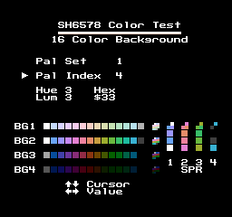
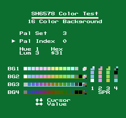

UM/NT/SH6578 Color Test
=======================
Written by freem; initially released on 2025/10/02

## Introduction
SH6578 Color Test is a small utility ROM allowing you to preview the palette colors
of the SH6578 in 16 color mode. 
This is a follow-up (but not a sequel) to my [VT03 Color Test tool](https://github.com/freem/colortest-vt03).

While "UM6578", "NT6578", and "SH6578" all refer to the same chipset,
this program and its documentation use "SH6578", as that was the only version
I was able to find a datasheet for.

## Requirements
SH6578 supporting emulator (NintendulatorNRS, MAME) or hardware (untested,
as I don't own any SH6578 devices)

## Files
Aside from this text file, there are two ROM files included in this package:
- `colortest-sh6578.bin` - for use in MAME (recommended ROM set `bb6578`, rename bin file to `tv game baseball.bin`)
- `colortest-sh6578.nes` - for use in NintendulatorNRS

The source code builds with asm6f, but should also work with regular asm6.

Some screenshots are also included, mainly for documentation's sake.

## Interface

Background palettes are found near the bottom middle of the screen, while the
Sprite palettes are on the right. Each palette preview includes solid color
swatches, as well as a single 4bpp tile showing all 16 (background)
or 3 (sprite) colors of the palette set.

The value labeled "Hex" is the byte required to define the color.

There are four items that can be modified:

- "**Pal Set**" refers to the active set of palettes being edited.
  Values range from 1-4. Sprite colors are found in set 2.
- "**Pal Index**" refers to the specific color within the selected palette set.
  Values range from `0-F` (0-15).
- "**Hue**" modifies the Hue of the current color. Values range from `0-F` (0-15).
- "**Lum**" modifies the Luminance of the current color. Values range from 0-3.

## Usage
Use the D-Pad to move the cursor (Up/Down) and change values (Left/Right).
If you need to reset, press Select+Start.

## Technical Details
This program was developed using emulators (primarily NintendulatorNRS)
as the testing platform. It may or may not work on real hardware.
I don't have any to test with.

The only difference between the MAME and NintendulatorNRS ROM files is the
NES 2.0 header.

MAME (v0.281) exposes an interesting difference or two compared to NintendulatorNRS.
This is best explained with a screenshot:

Some notes:
- Each palette set's background color is handled separately.
- Values `$1F` and `$3F` are treated as transparent (for background colors,
  at least). This results in the last color of palette set 1 blending in with
  the background. This behavior is not extended to `$0F` or `$2F`,
  as those two appear black (RGB 0,0,0).

I do not know how real hardware handles these situations.

Graphics for this tool were created using [YY-CHR](https://w.atwiki.jp/yychr/).
4BPP background tiles use "4BPP 8X8" mode, and regular NES format for the
2BPP sprite tiles.

Palette values are simpler than VT03, but a technical note from UMC leaves me
with more questions than answers... That's a topic for another time, though.
